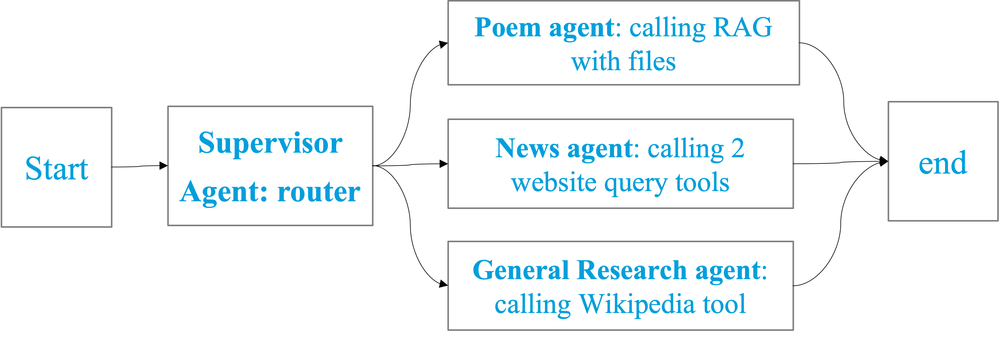

<!--

Licensed under the Apache License, Version 2.0 (the "License");
you may not use this file except in compliance with the License.
You may obtain a copy of the License at

http://www.apache.org/licenses/LICENSE-2.0

Unless required by applicable law or agreed to in writing, software
distributed under the License is distributed on an "AS IS" BASIS,
WITHOUT WARRANTIES OR CONDITIONS OF ANY KIND, either express or implied.
See the License for the specific language governing permissions and
limitations under the License.
-->


# MYRA - MY mind-Reading Agent

**MYRA** is a multi-agent AI system that is personalized with user's preference in mind. 
It’s complexed enough to handle questions that chatGPT can not even do as it’s personalized for users' preference! 
Check out this demo to see how it works and built: [MYRA](https://youtu.be/V1T-yCg4lAo)

 > - For example, instead of asking question with details like "what is the weather in Atlanta today", I can just ask "weather today" and it will return the weather in Atlanta if I set my favorite location as 'Atlanta'. 
 > - Another example is 'show me a poem about mountains' and it will return a poem from my local favorite collection instead of searching the web.

MYRA is a multi-agent system that can be used to query multiple sources of information, including local files, web pages, and Wikipedia. It is designed to be flexible and extensible, allowing users to add new agents and tools as needed.


MYRA is built using a set of LangChain/LangGraph agents in Nvidia AIQ toolkit with several custom and pre-built tools, ReAct Agents and workflows.


## Component Overview

In current **MYRA**, as time is limited, I only added 3 features - my daily ask of weather in a preferred location and stock news in Yahoo Finance, my favorite poems in my local collection, and general questions using Wikipedia. More to come!


Here are the 3 agents:
- **News Agent** – agent calling website query tool with my preferred location and news resource.
- **General Research Agent** – agent calling wikipedia tool.
- **Poem Agent** –  agent calling a RAG tool with my local files ingested.


LangChain and LangGraph is used to unify these agents into a single workflow as I like to control the routing more efficiently.


There is a supervisor agent that will assign/route incoming user query to one of the worker agents:

- (1) a `poem_react_agent` made out of `Langchain` via a `text_file_ingest` tool to ingest my local files.
- (2) a `news_agent` made out of `Langchian` via tools `website_query` and `current_datetime` to generate information from a provided website (url) at near real time.
- (3) a `wiki_agent` made out of `LangChain` with `wiki_search` as a tool to retrieve relevant contexts from wikipedia search for the given question.

The multi-agents architecture looks like the below:



## Local Installation and Usage

### Step 1: Set Up Your Environment and Install AIQ Toolkit
Follow the instructions in the [Install Guide](./docs/source/quick-start/installing.md#install-from-source) to create the development environment and install AIQ toolkit.

### Step 2: Set Your NVIDIA API Key 
If you have not already done so, follow the [Obtaining API Keys](./docs/source/quick-start/installing.md#obtaining-api-keys) instructions to obtain an NVIDIA API key. You need to set your NVIDIA API key as an environment variable to access NVIDIA AI services.

```bash
export NVIDIA_API_KEY=<YOUR_API_KEY>
```

### Step 3: Install the `text_file_ingestion` Workflow

**Install the `text_file_ingestion` Workflow**

```bash
uv pip install -e examples/documentation_guides/workflow/text_file_ingestion
```

### Step 4: Customize and Install the `multi_frameworks` Workflow

Check the code change made in [register function](./examples/multi_frameworks/src/register.py) especially for `router_prompt`. 

**Install the `multi_frameworks` Workflow**

```bash
uv pip install -e examples/multi_frameworks
```

### Step 5: Run the `multi_frameworks` Workflow

**Run the `multi_frameworks` Workflow**

note: the below is an example command to use and query this and trigger `poem_react_agent`

```bash
aiq run --config_file=MyPersonalizedAgent/config_My_mcp.yml --input "show me a poem about mountains"
```

## Acknowledgements
- [Nvidia AIQToolkit](https://github.com/NVIDIA/AIQToolkit.git)